# PGApp_beta
Beta version of the PG App

SPLASH SCREEN   

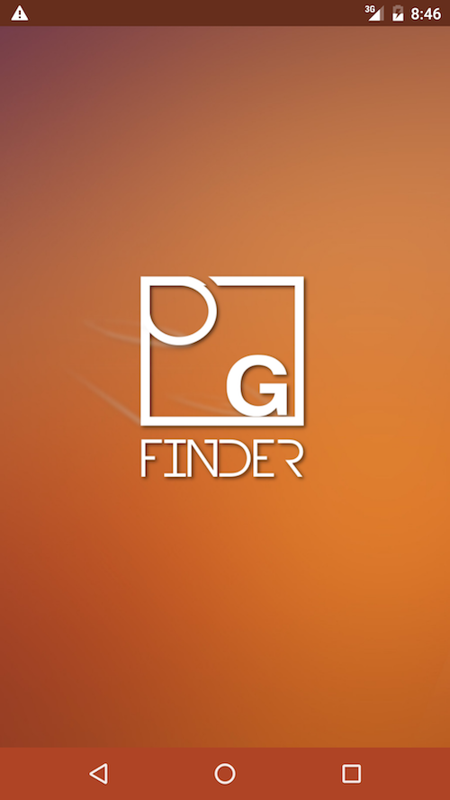      

MAIN SCREEN->

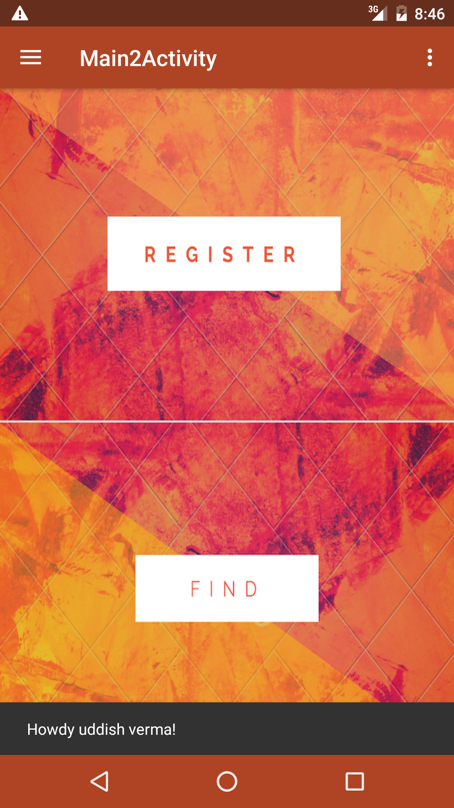                 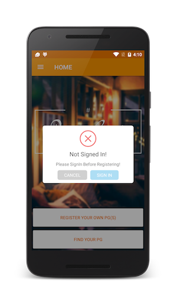 

REGISTER PG ACTIVITY->
This activity allows only the signed in users to register their PG and list it in the app using firebase realtime database

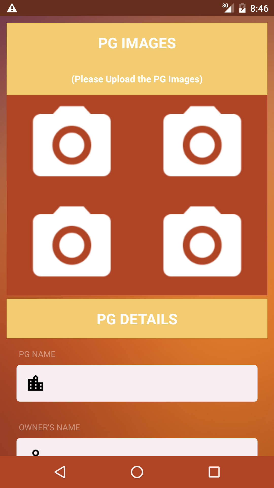               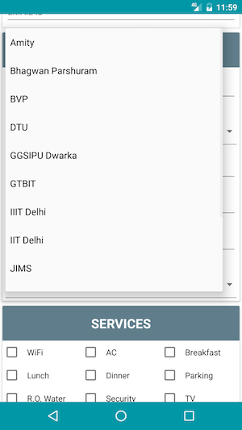
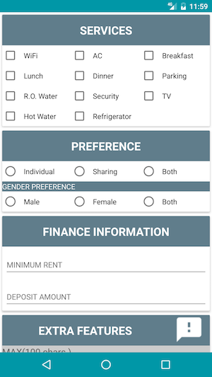                 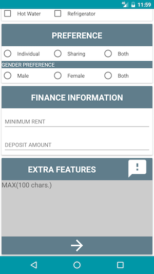

FIND PG ACTIVITY->
This activity enables any user(Logged in ot Guest) to search for the appropriate PG by applying filters(By College, Locality etc.)

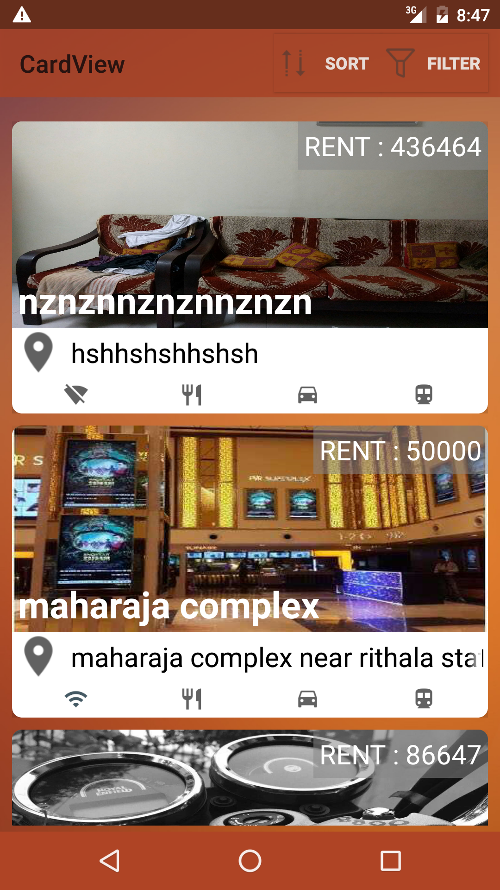 

EXPANDED VIEW OF THE PGs LISTED IN THE FIND ACTIVITY->
This activity shows an expanded view of the PG selected making use of fragments, viewpagers.

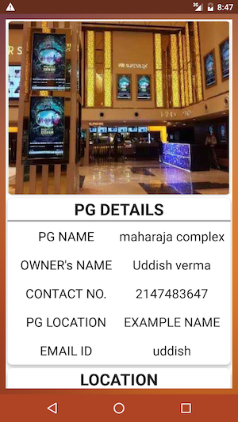        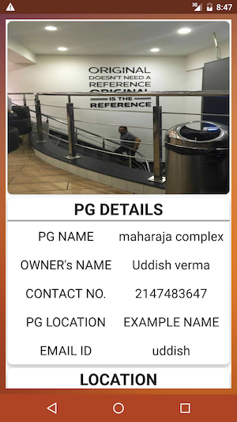 

 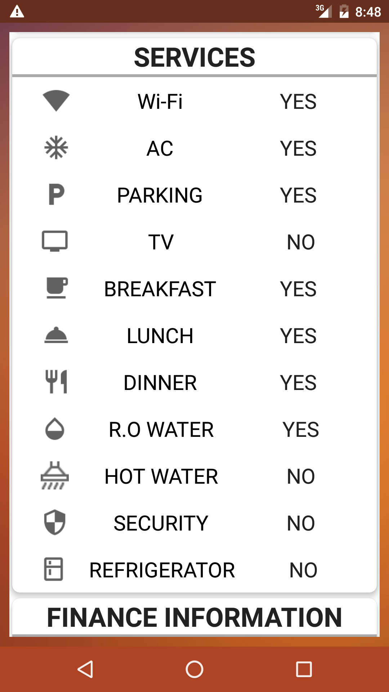       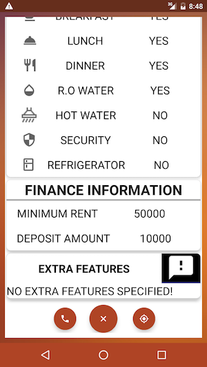
     

LOGIN AND SIGN UP->

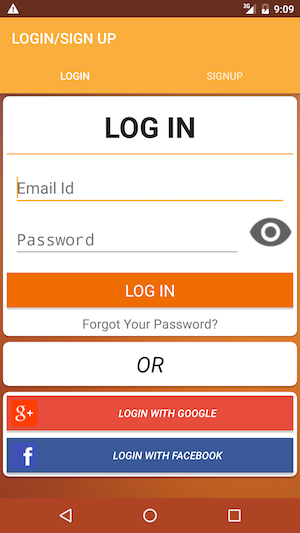          

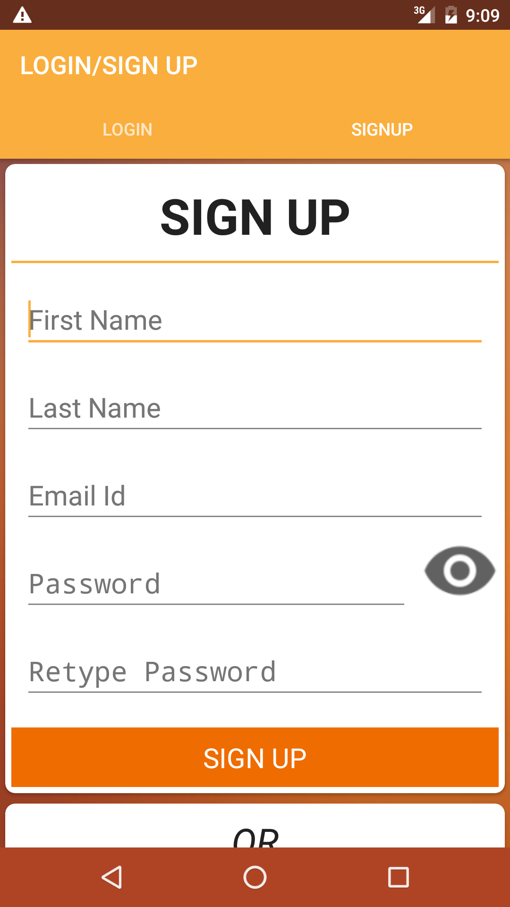    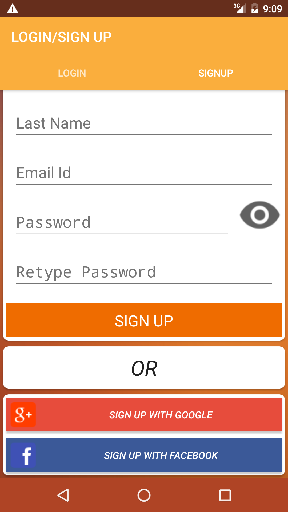

FILTERS->
PGs can be Filtered by selecting the appropriate one from the toolbar.

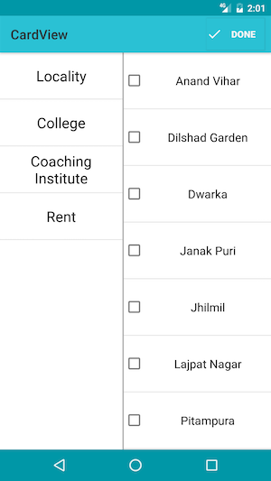    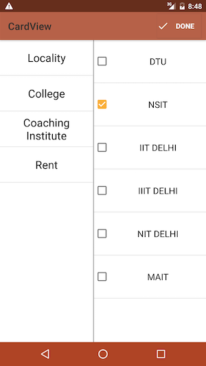

NAVIGATION DRAWER ->

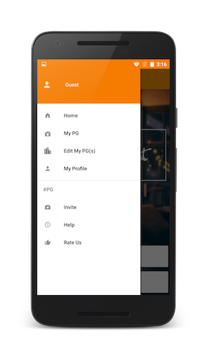    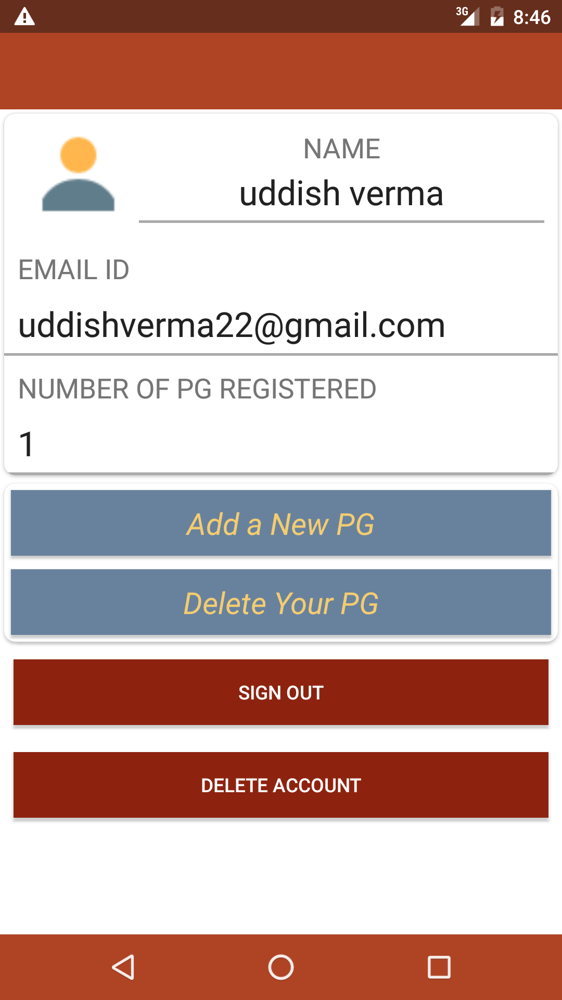
